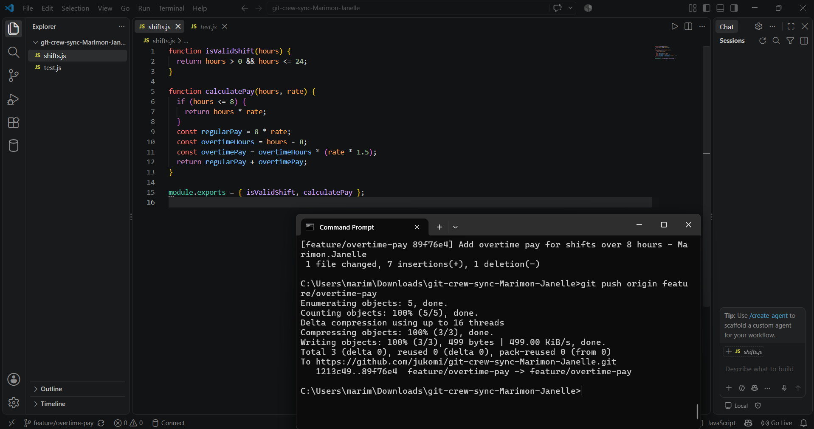
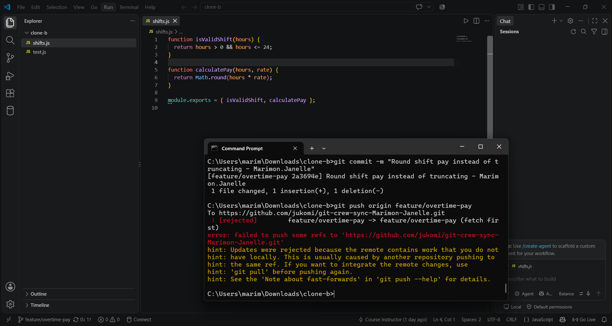
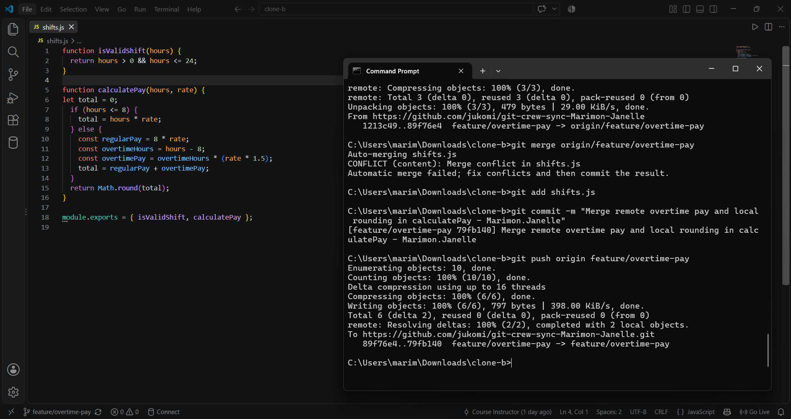
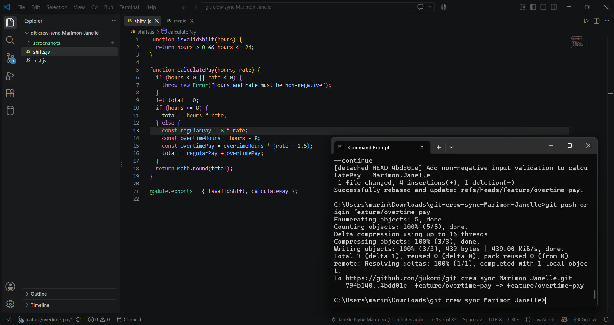
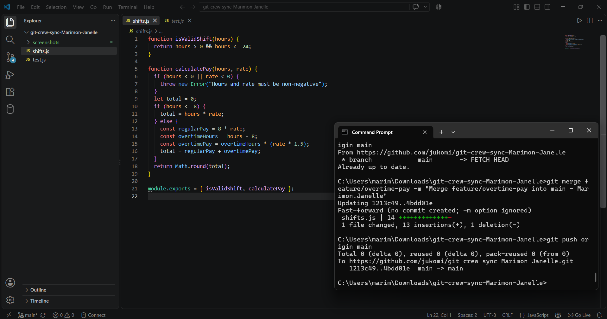
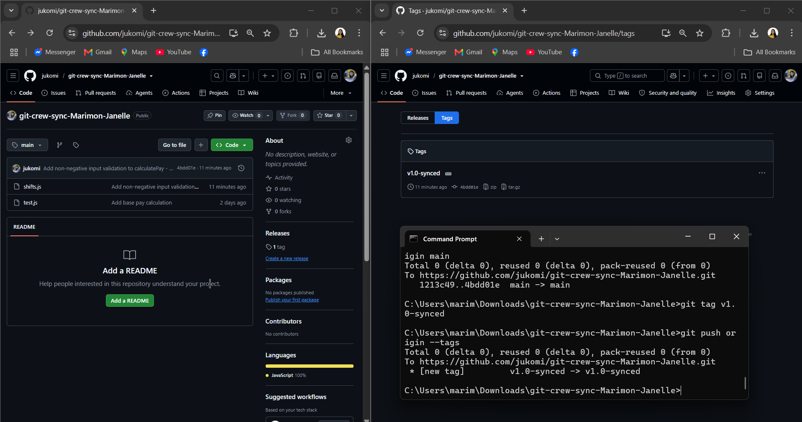

# Git Crew Sync Lab Workflow Report

**Name:** Janelle Klyne Marimon  
**Repository:** https://github.com/jukomi/git-crew-sync-Marimon-Janelle  

---

## Task 1 Evidence: Successful Push from Clone A

## Task 2 Evidence: Divergence and Rejected Push from Clone B

## Task 3 Evidence: Reconciliation via Merge

## Task 4 Evidence: Reconciliation via Rebase

## Task 5 Evidence: Merge into Main

## Task 6 Evidence: Tagged v1.0-synced

---

## Written Answers

### 1. What did the rejected push error message tell you, and why did it happen?
The rejected push error (`! [rejected] - non-fast-forward`) with the hint `Updates were rejected because the remote contains work that you do not have locally` indicates that another teammate (or clone) pushed commits to the remote branch that the local workspace has not yet incorporated. Git prevents non-fast-forward pushes by default so that upstream commits cannot be unintentionally overwritten or lost.

### 2. What's the actual difference between how you resolved Task 3 (merge) vs Task 4 (rebase)?
- **Task 3 (Merge):** Created a non-linear history with a dedicated merge commit joining two divergent branches together. It preserved the exact chronological timeline and branch structure of both developers working concurrently.
- **Task 4 (Rebase):** Rewrote the local commit history by lifting the local commits, advancing the base of the branch to match `origin/feature/overtime-pay`, and then replaying the local commits on top of that updated tip. This resulted in a clean, linear commit history without adding an explicit merge commit.

### 3. What one habit would have avoided both rejected pushes in this lab?
Running `git fetch` and `git pull` right before beginning work and immediately prior to pushing would ensure the local branch stays synchronized with any newly pushed upstream commits, avoiding push rejections.

### 4. Which approach — merge or rebase — would you default to on a shared team branch, and why?
**Merge** is the safer default on a shared team branch. Rebasing rewrites commit SHA hashes; when multiple developers actively pull from and push to the same branch, rebasing can diverge local tracking branches and create duplicate commits or confusion. Rebase is best reserved for private local feature branches before integrating them upstream.
